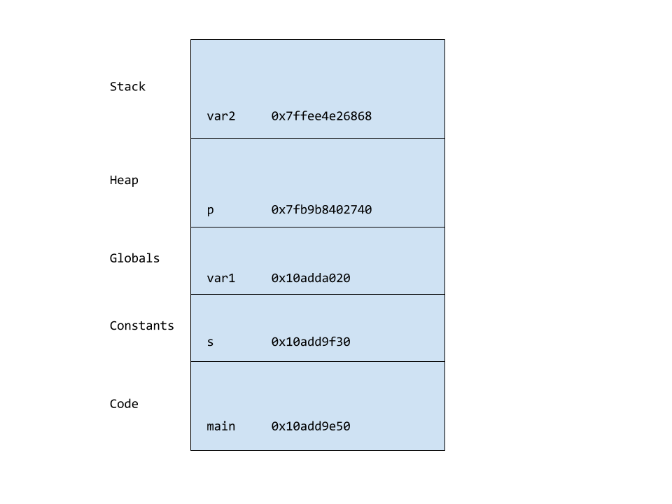

# Exercise 2

### The address space

1. Compile and run `aspace.c` in this directory.

2. Read the code.  You might want to [read about malloc here](https://www.tutorialspoint.com/c_standard_library/c_function_malloc.htm).

3. Based on the output, draw a sketch of the virtual address space (see page 80 of HFC).  Show the relative locations of the stack, heap, globals, constants, and code.

4. Add a second call to `malloc` and check whether the heap on your system grows up (toward larger addresses).  

5. Add a function that prints the address of a local variable, and check whether the stack grows down.  

The stack goes down.

6. Choose a random number between 1 and 32, and allocate two chunks with that size.  
How much space is there between them?  Hint: Google knows how to subtract hexadecimal numbers.

I allocated 12 bytes, and there was 0x10 between them, or 16 bytes. Cool!

### Stack allocated data

1.  Read `stack.c`, which should be in this directory.  What is it
intended to do?  What would the output be if the program worked as
expected?

Expected behavior:
  - It seems that `stack.c` is intended to print out the contents of the array - which should be `{42, 42, 42, 42, 42}`. 

2.  Compile it.  Do you get a warning?  What does it mean?

  - I get a warning generated that says - `stack.c:23:12: warning: address of stack memory associated with local variable 'array' returned [-Wreturn-stack-address]`. As far as I can tell, this warning is telling me that I'm returning the address of an array that lives on the stack, which is a dangerous thing to do because this memory could be used by someone else as soon as another function is called and its data gets put in the stack, overwriting the data that I was trying to point to. 

3.  Run it.  What happens?  You might get a segmentation fault, or you might get
some strange output.  Can you explain it?  You might find it
helpful to draw a stack diagram.

  - When I run it, I don't get a segmentation fault, but I do get some very strange behavior - the printed output of the values at the address in the array I returned are `{0, some_random_value, 0, 0, 0}` - which is not at all what I expected. This is happening because the memory in the stack is being overwritten by other function calls. In fact, when the function `bar` runs, it outputs the same memory address that `foo` pointed to for the array. `bar` is free to modify and mess with the data in these addresses. 

4.  Comment out the `print` statements in `foo()` and `bar()` and run
it again.  What happens now?

  - When I comment out the `print` statements, I still get the same output. 

5.  Add comments to the code to explain these experiments and the results,
then check the code in to the repo.

Moral: Don't return pointers to stack allocated data!

### Adder

Create a file named `adder.c` and write a program that allows the user to enter integers, one per line, until the user hits Control-D, which is the end-of-file (EOF) character.

It should convert the numbers from input strings to integers and store the integers in an array.  The program should produce appropriate error messages if the user enters something that exceeds the length of the input buffer, or can't be converted to an integer.  It should also produce an error message if the user enters more numbers than will fit in the array.

After the user enters Control-D, the program should add up the numbers in the array and print the result.  

Your program should be divided into at least two functions with well designed interfaces.

Optionally, the program should produce an error if the sum exceeds the largest integer that can be represented.

Hint: You will probably want to use two functions we haven't seen yet:

* strlen: [Read about it here](https://www.tutorialspoint.com/c_standard_library/c_function_strlen.htm)

* atoi: [Read about it here](https://www.tutorialspoint.com/c_standard_library/c_function_atoi.htm)

Before you use there functions, you need to `#include <string.h>`.
